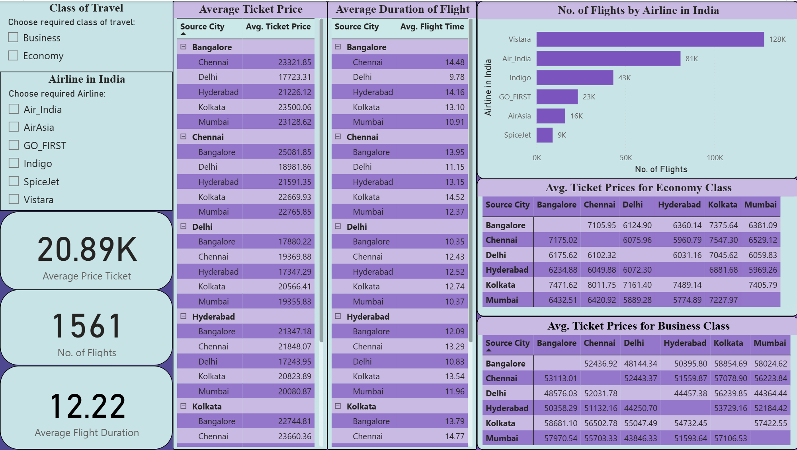
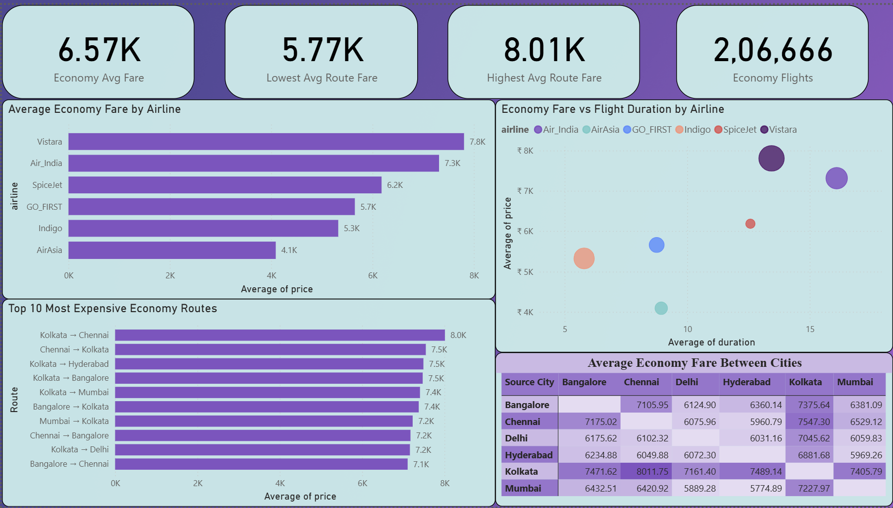
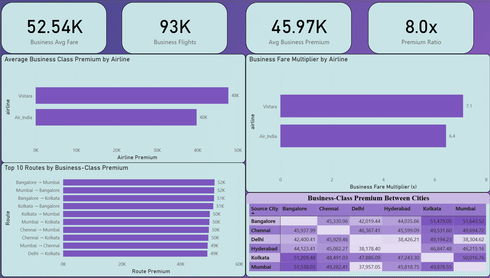
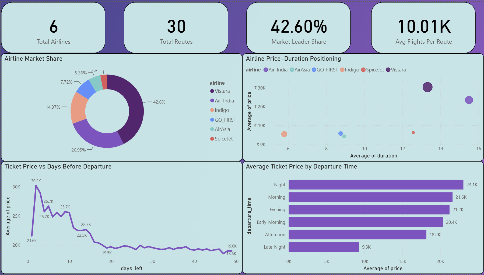

# ✈️ Indian Airlines Price Analysis Dashboard

A comprehensive Power BI analytics project exploring airfare pricing patterns, airline market positioning, route profitability, customer booking behavior, and business-class premium trends across major Indian airlines.

---

## 📌 Project Overview

The Indian aviation industry is highly competitive, with ticket prices influenced by airline choice, route, travel class, flight duration, booking window, and departure timing.

This project analyzes over **300,000 flight records** across major Indian airlines to uncover:

- Airline pricing strategies
- Economy vs Business class fare differences
- Route-level pricing patterns
- Customer booking behavior
- Airline market share and positioning
- Factors impacting ticket prices

---

## 🎯 Business Objectives

- Analyze ticket pricing trends across airlines and routes.
- Identify the most expensive and cheapest routes.
- Understand Business Class premium pricing.
- Evaluate airline market positioning.
- Measure the impact of booking windows on airfare.
- Generate actionable business insights using Power BI.

---

# 📊 Dashboard Walkthrough

---

# Page 1 — Executive Overview



## Purpose

Provides a high-level summary of the Indian airline market and serves as the landing page for the dashboard.

## Key Metrics

- Average Ticket Price
- Total Flights
- Average Flight Duration

## Visuals

- Average Ticket Price by Route
- Average Flight Duration by Route
- Flights by Airline
- Economy Fare Matrix
- Business Fare Matrix

## Key Insights

- Vistara and Air India dominate premium pricing.
- Major metro routes consistently command higher fares.
- Significant variation exists in route-level flight durations.

---

# Page 2 — Economy Class Analysis



## Purpose

Analyzes Economy-class pricing trends, airline positioning, and route-level fare patterns.

## Key Metrics

- Economy Average Fare
- Lowest Average Route Fare
- Highest Average Route Fare
- Economy Flights

## Visuals

- Average Economy Fare by Airline
- Economy Fare vs Flight Duration by Airline
- Top 10 Most Expensive Economy Routes
- Economy Fare Heatmap Between Cities

## Key Insights

- Vistara has the highest average Economy fares.
- AirAsia offers the lowest Economy pricing.
- Kolkata-originating routes frequently appear among the most expensive.
- Longer flights generally correlate with higher fares.

---

# Page 3 — Business Class Premium Analysis



## Purpose

Examines premium pricing behavior and customer willingness to pay for Business Class travel.

## Key Metrics

- Business Average Fare
- Business Flights
- Average Business Premium
- Business Fare Multiplier

## Visuals

- Average Business-Class Premium by Airline
- Business Fare Multiplier by Airline
- Top 10 Routes by Business-Class Premium
- Business-Class Premium Heatmap

## Key Insights

- Business Class tickets cost approximately **8x more** than Economy tickets on average.
- Vistara commands the highest premium pricing.
- Bangalore–Mumbai and Bangalore–Kolkata routes generate the highest premiums.
- Business travelers exhibit significantly higher willingness to pay.

---

# Page 4 — Competitive Landscape & Strategy



## Purpose

Evaluates airline market structure, competitive positioning, and customer booking behavior.

## Key Metrics

- Total Airlines
- Total Routes
- Market Leader Share
- Average Flights Per Route

## Visuals

- Airline Market Share
- Airline Price–Duration Positioning Matrix
- Ticket Price vs Days Before Departure
- Average Ticket Price by Departure Time

## Key Insights

- Vistara holds the largest market share (~43%).
- Air India is the second-largest airline in the dataset.
- Premium airlines operate longer-duration routes at significantly higher fares.
- Ticket prices rise sharply as departure dates approach.
- Night departures command the highest average fares.

---

# 📈 Overall Business Findings

### Pricing Strategy

- Fare prices vary significantly by airline, route, and travel class.
- Business Class fares are approximately 8x higher than Economy fares.

### Customer Behavior

- Booking closer to departure results in substantially higher ticket prices.
- Departure timing influences pricing patterns.

### Competitive Landscape

- Vistara occupies the premium segment of the market.
- Air India follows as the second-largest premium carrier.
- Budget airlines compete primarily through lower pricing and shorter routes.

### Route Economics

- Metro-to-metro routes consistently generate the highest fares.
- Certain city pairs support significantly higher Business-Class premiums.

---

## 🛠️ Tools & Technologies

### Data Processing

- Python
- Pandas
- NumPy

### Data Visualization

- Power BI
- DAX

### Development Environment

- Jupyter Notebook
- VS Code
- Git
- GitHub

---

## 📂 Project Structure

```text
Indian-Airlines-Price-Analysis/
│
├── data/
│   ├── Indian Airlines.csv
│   ├── economy.csv
│   └── business.csv
│
├── dashboard/
│   └── Indian_Airlines_Analysis.pbix
│
├── visuals/
│   ├── overview.png
│   ├── economy_analysis.png
│   ├── business_analysis.png
│   └── competitive_landscape.png
│
├── eda.ipynb
├── README.md
├── requirements.txt
└── LICENSE
```

---

## 🚀 Future Enhancements

- Airfare forecasting using Machine Learning
- Route profitability modeling
- Dynamic pricing simulations
- Customer segmentation analysis
- Airline recommendation engine

---

## 👨‍💻 Author

**Vyom Mangtani**


⭐ If you found this project useful, consider starring the repository.